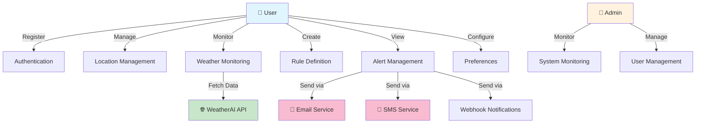
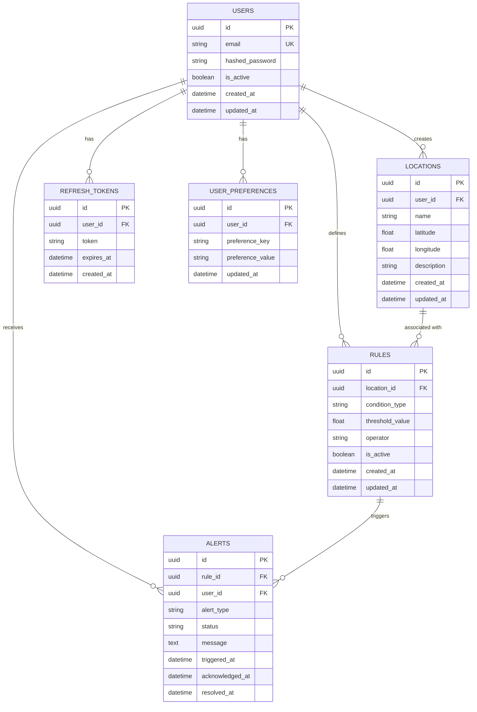
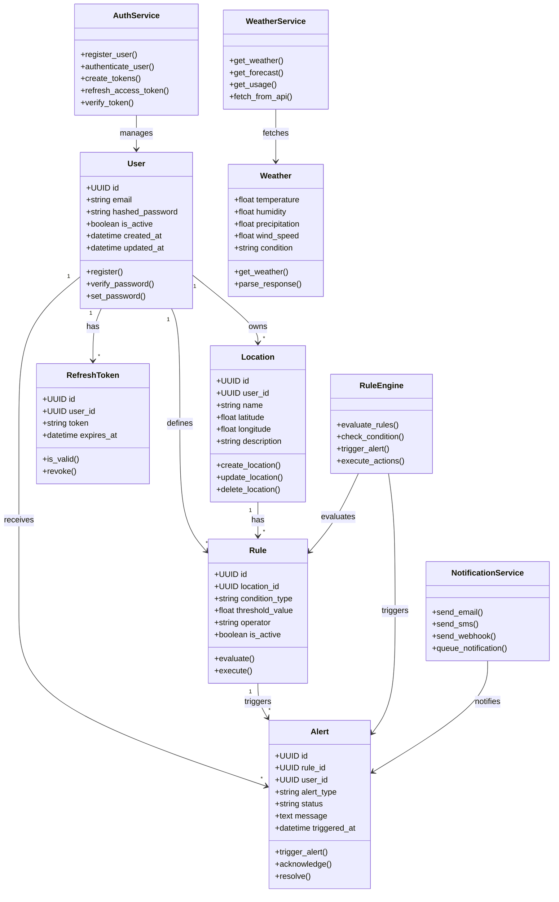
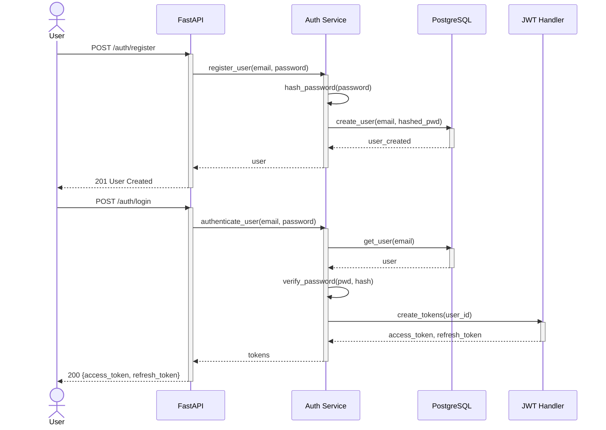
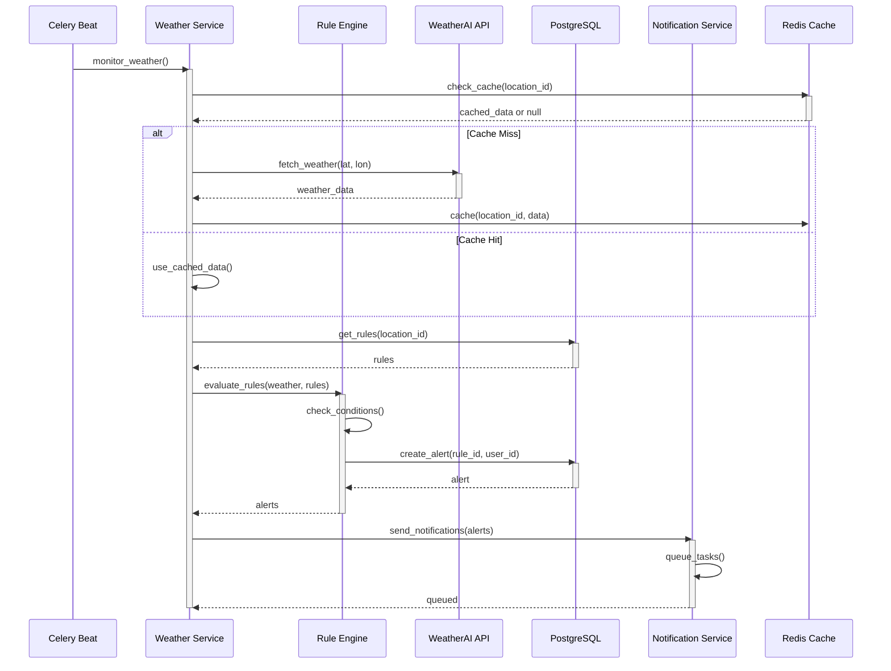
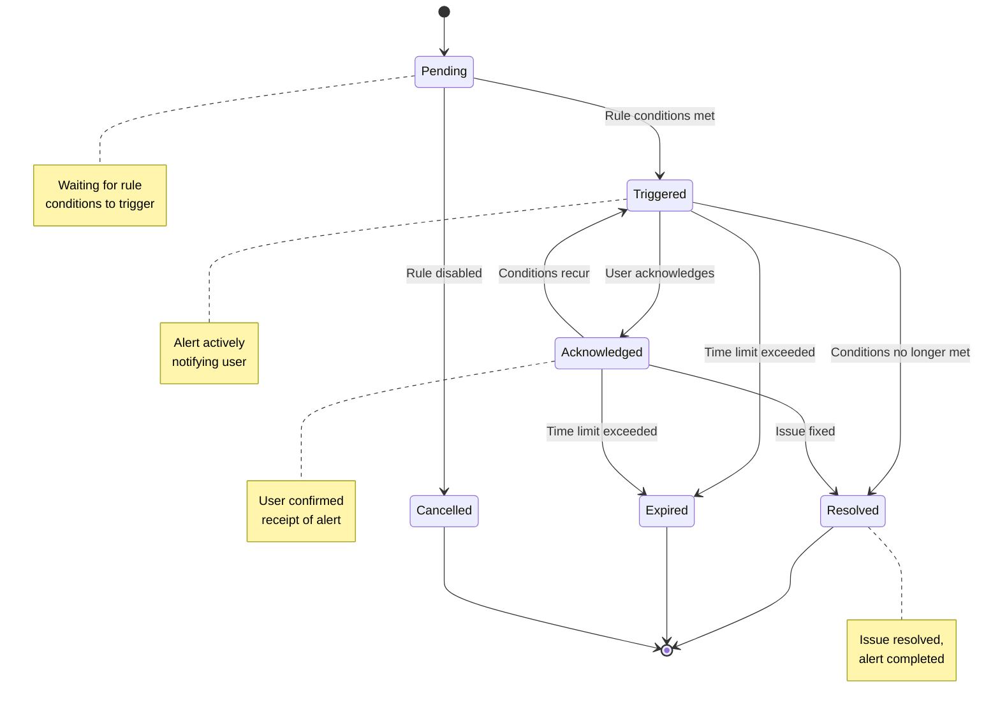
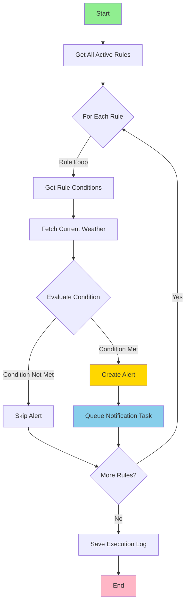
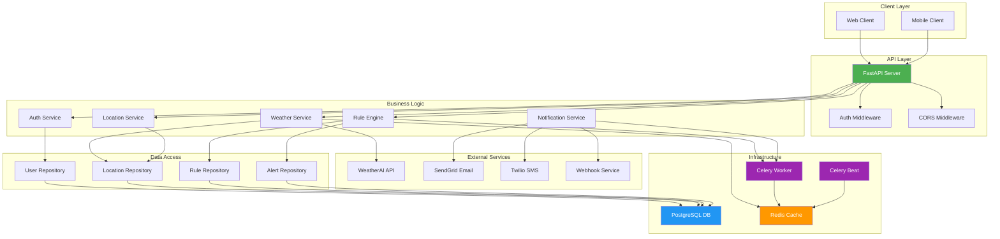
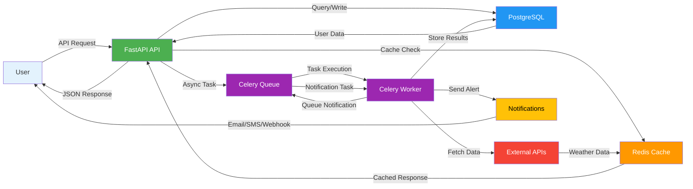
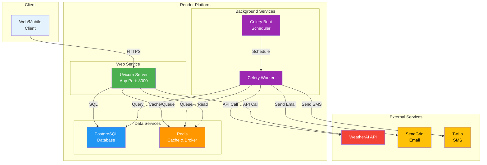

# WeatherOps System Diagrams

## 1. Use Case Diagram

## 2. Entity Relationship Diagram (ERD)

## 3. Class Diagram

## 4. Sequence Diagram: User Registration & Authentication

## 5. Sequence Diagram: Weather Monitoring & Alert Triggering

## 6. State Diagram: Alert Lifecycle

## 7. Activity Diagram: Rule Evaluation Flow

## 8. Component Diagram

## 9. Data Flow Diagram

## 10. Deployment Architecture Diagram

---

## Diagram Legend

- **Solid Arrows** → Direct synchronous communication
- **Dashed Arrows** → Asynchronous/event-driven communication
- **Blue** → Data layer (Database)
- **Orange** → Cache/Queue layer (Redis)
- **Green** → API/Web layer
- **Purple** → Background processing (Celery)
- **Red** → External services

## References

- [C4 Model](https://c4model.com/) - Component diagrams
- [UML Sequence Diagrams](https://www.omg.org/spec/UML/) - Interaction flows
- [State Machine Diagrams](https://en.wikipedia.org/wiki/State_diagram) - Process states
